# Recipiy | Milestone Project 3

Recipiy is an online recipe site whereby users can view recipes to use freely. They can also sign up and use the features of being able to upload their own recipes or simply just save them to their own personal page for a later date. The aim is for returning customers to be able to use this on many occasions whether it is making a simple lunch or a special dinner. 

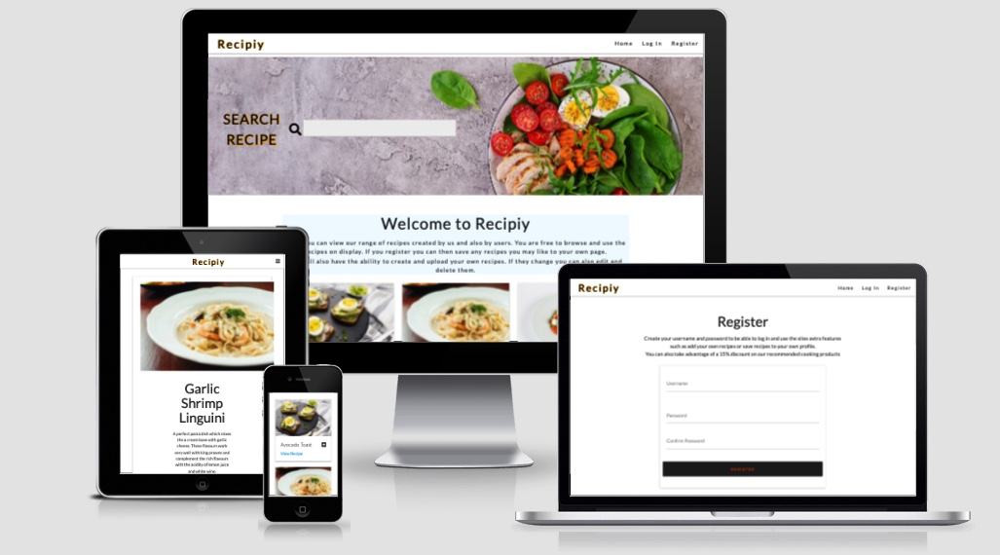 

* [User Experience](#user-experience)
    * [User Stories](#user-stories)
    * [Design](#design)
    * [Wireframes](#wireframe)
* [Features](#features)
    * [Current Features](#current)
    * [Features to Implement](#future)
* [Technologies Used](#tech)
    * [Font-end Technologies](#front)
    * [Back-End Technologies](#back)
* [Testing](#test)
    * [Validators](#valid)
    * [Compatability](#test)
    * [Bugs and Known Issues](#bugs)
* [Deployment](#deploy)
    * [Local Deployment](#local)
    * [Remote Deployment](#remote)
* [Credits](#credit)

<a name="user-experience"></a>

# User Experience

<a name="user-stories"></a>

## User Stories

### As a First Time User:

* I want to be able to visit the site without having to register an account to view recipes.
* I want to have a reason of why I would want to register an account.
* I want to be able to search for specific recipes if they exist.
* I want to be able to navigate easily through the site.
* I want to be able to view this site on any device.
* I want to search for specific ingredients within recipes.
* I want to be able to view a range of different recipes.

### As a Returning User:

* I want to be able to securely log into my account
* I want to be able to upload and share my recipe with others on the site
* I want to be able to edit my recipes if they happen to improve over time
* I want to be able to delete my recipe at any time
* I want to be able to have a section of where I can save other users recipes including my own.
* I want to be able to see if the recipes include any allergens.

### As a Site Owner:

* I want to be able to add new collections or pages to the site
* I want the new collection to be added to the appropriate areas whether it is home page or within users displayed pages.
* I want to be able to edit or delete any pre-existing collections.
* I want to be able to edit any promotions or advertising on the site at any time.
* I want my users to be informed correctly if any allergens are present in the recipes. 
* I want to encourage everyday usage of the site, something which can be used by people frequently.

## Design

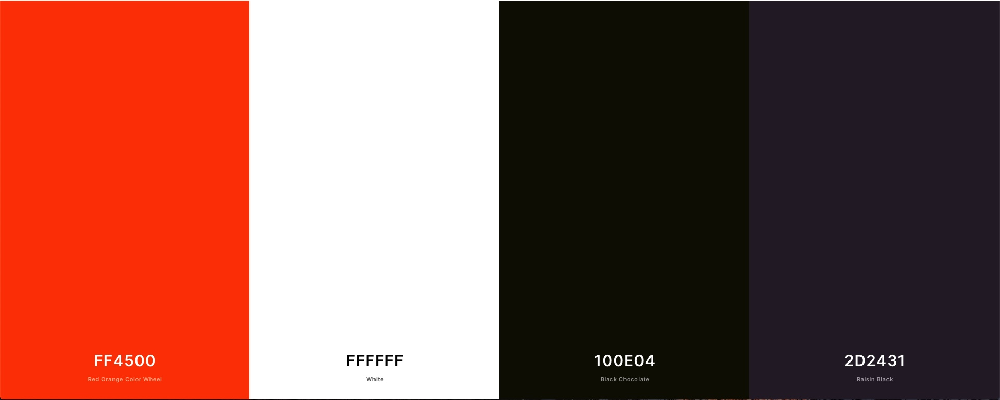

* Colour Scheme
    * I have kept a very simple and clean look to the page with not much colour. This is very common and wide spread with many recipe sites.
    The simplicity means users can focus on the imagery and then also on the information. I have used a white background to enforce this as
    it emphasises on the imagery and the information displayed. 

* Typography
    * I have used google fonts for this project again and the main font I have chosen is 'Lato'. This is for the simplicity and readability
    of the font. It is very clear and easy to read especially when using letter spacing as the text sits very well when centered. The other
    font used is Sans Serif, however this is a fallback font just incase google fonts cannot load. Again Sans Serif is widely used and very
    simple and easy to read. As this is mainly a recipe app and want to be able to easily read the information being given. 

* Icons
    * Font Awesome 5.13.1 - I chose to use Font Awesone Icons instead of the Materialise Icons due to there being much more range and options.
    They are also better to target and style. They are also responsive on all screensizes. 

* Imagery
    * The imagery used by myself are mainly professional images taken from pixels and unsplash. The users have the option to upload their own
    images to their recipes via a url link. This means the main page recipe images are subject to continuos change. The images throughout are
     very important to user experience as they are the main selling point of the recipe. Without an image the card in the home page is very
     bland along with all the other pages. The images are key when using a modern styling and white backgrounds as they stand out and become 
     a feature themselves. 

     The other visual parts are the titles and headers which have also been styled to a minimalistic look to provide a sense of elegance to the
      page. The images and the information needs to take center stage in my opinion which is the reasoning behind the styling and imagery. The 
      food needs to be attractive and presentable and then the information needs to stand out and be easy to read and follow. 


* Wireframes

    * The wireframes provided are designed for computer, tablet and Mobile displays. The simplicity of layout doesn't offer much differences between
    and tablet. The wireframe initial design changed slightly as I realised the main home page cards were too small/clutered to hold all the
    information of the recipes and images. A new page was created to house these when a user chooses to view the recipe via a link. The form and
    registration pages also have minor changes from the intitial design. 

    
    * View all Wireframes [Here](https://github.com/BesnikShala/Recipiy-MS3-Project/tree/main/documentation/Wireframes)

    <a name="wireframe"></a>

    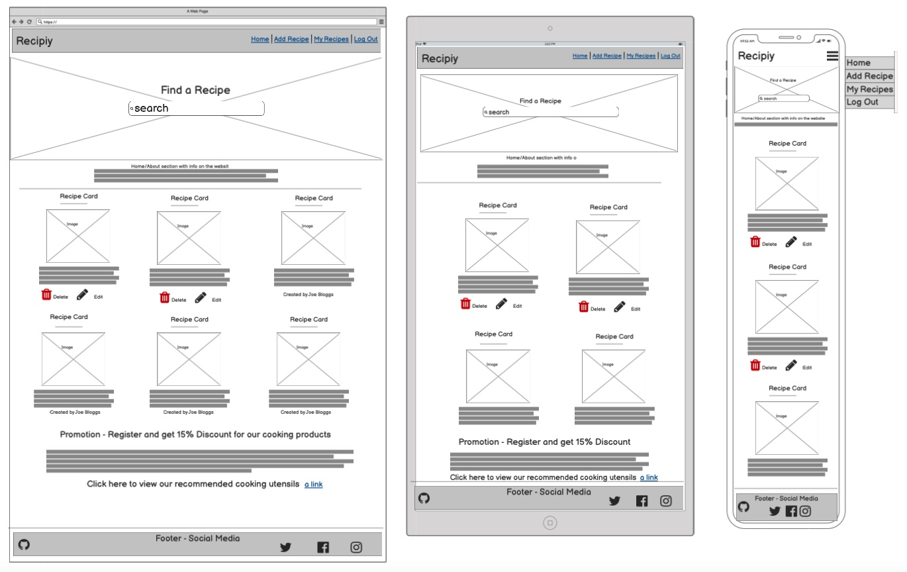
    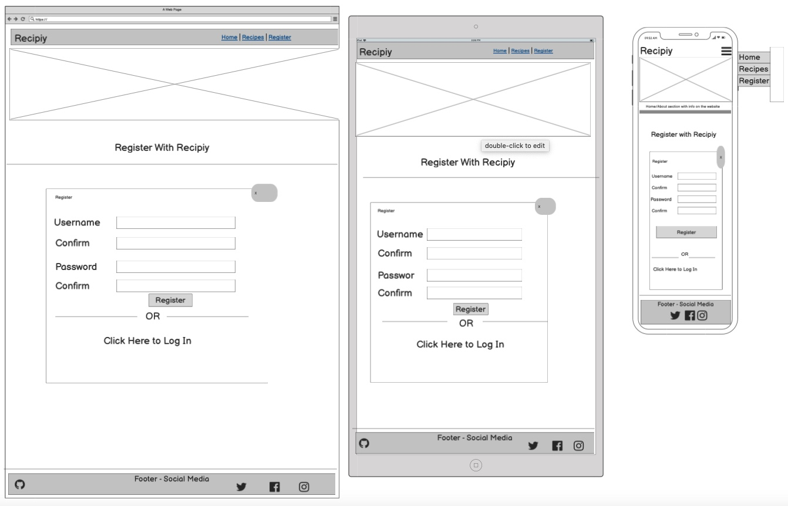
    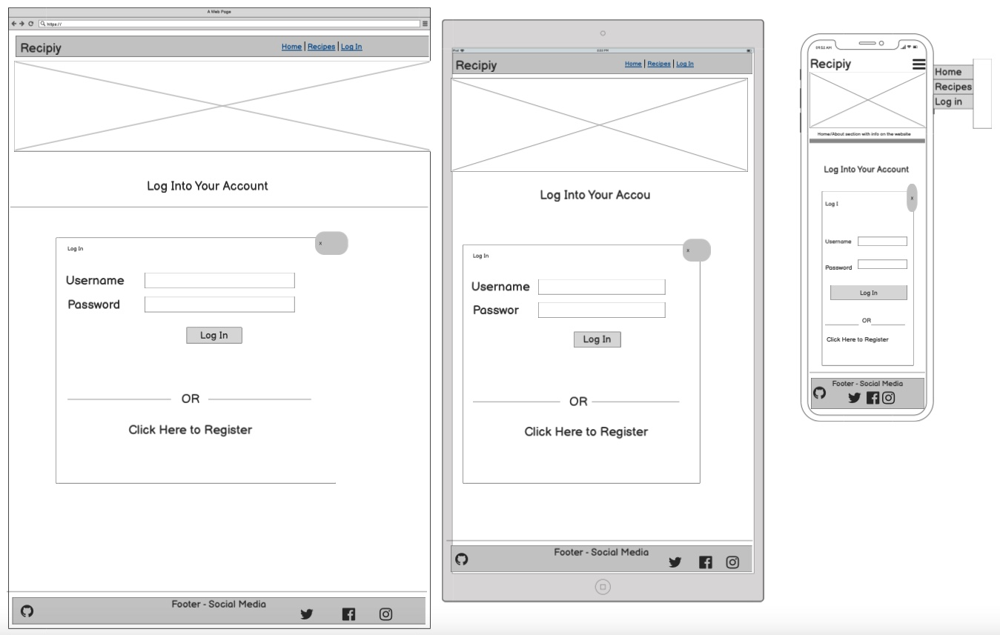
    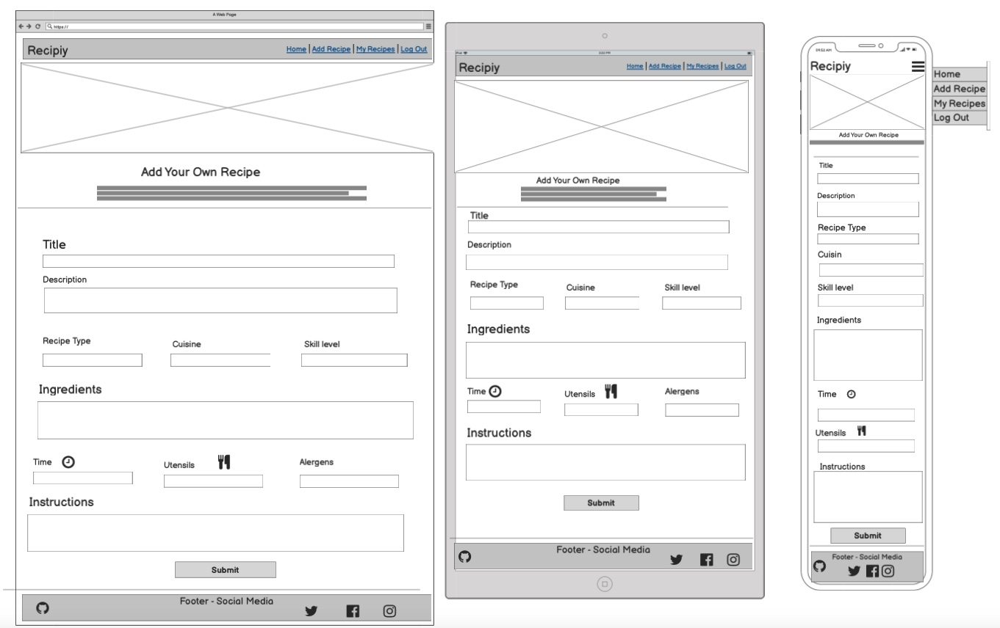
    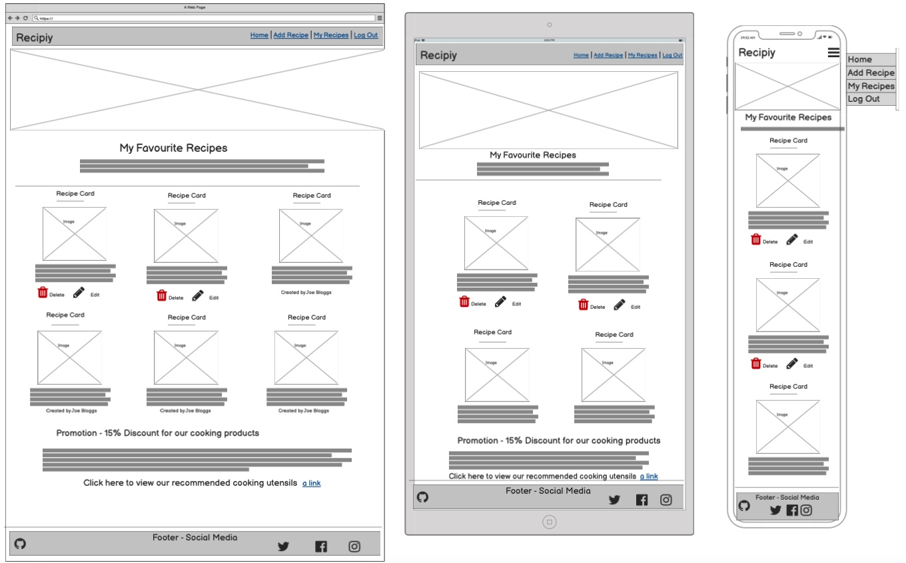
    

## Database Schema

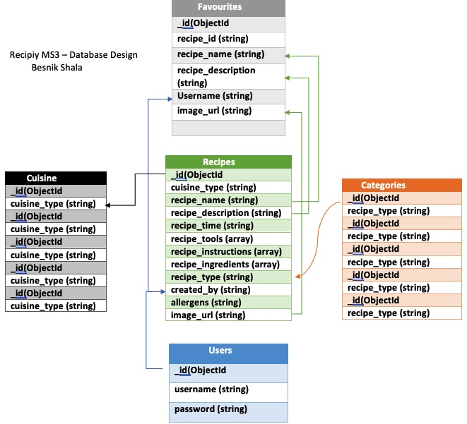

* Everything in the database is connected to the recipe collection. This is the heart of the data that connects everything else. From here users will be linked to their recipes via the created_by key. They can then choose a list of drop down values from the categories and cuisine collections. They can also add a recipe to the favourites collection which is accessable only for them. 

## Features

* Register an Account with Recipiy

    * A user can view recipes without creating an account. However they will receive more features if they do so. A user can easily register an 
    account via the nav-link. The passwords are hashed for security and there is a confirmation process for the passsword to make sure there are
    no spelling mistakes. A flash message will appear if they have correctly registered an account.

* Log In and Out of Recipiy 

    * Once a user has created an account they can log in and out of their account easily. They are notified if they have incorrectly entered a 
    password or username. The message does not hint whether the username or password is incorrect for anyone trying to hack another user's details.

[CRUD] Features Implemented

* View Recipes

    * Users can view recipes whether they have an account or not. The recipe cards are displayed on the home page for users to view the image, name
    and description. They then have the option to click on view recipe to view the full information on a separate page.

* Add Recipes
    
    * Existing users have the option to add their own recipes to the page. This is a feature which would encourage users to register with Recipiy,
    to have the option to upload their own recipes. This can be to store their recipes they may have or simply to share their unqiue recipes with
    others.

* Update Recipes

    * An existing user is able to upate their own recipes which they have uploaded. This is to amend any errors or it can be to improve a recipe.
    Whatever the reason may be this feature is available only to the user who created the recipe, so other users cannot alter any recipe.

* Delete Recipes

    * This feature is only available to the user who created the recipe, there is an option for the user to delete the recipe. They will be prompted via a modal to confirm if they would like to delete the recipe. 

* Search Recipe

    * A search bar on the home page which allows users to search recipes based on keywords within the title or description. I have also made
    ingredients a part of the keywords too if users want to search by ingredient. 

* View Recipe

    * Users have the option to view recipe cards in the home page which display brief information about the recipe. If they want to view the full
    recipe they can click on the link which takes them to a new page whereby they can view the full recipe details and cooking instructions.

* Add Recipe to My Recipes/Favourites

* Users who have logged in will be able to add recipes to their profile page under tab 'My Recipes'. This is to give users the ability to save 
    a specific and not have to search for it in the main page. They have access to it on their own page and can also remove or view the recipe.

* Add image via URL

    * Users can upload an image of their recipe by pasting in a url or 'image address' directly into the input field. This will render the image for the card and on the view recipe page. 

## Features Left to Implement

* Manage Account - Delete/Edit

    * Due to time constraints these will be future features to add. The users should they choose can delete their account if they no longer wish to be registered. The password will also be able to change/update.  

* Optional feature of Promotion

    * Users will be able to see recommended cooking utensils as an extra feature, this would open a new external page and direct users to an external
    site to view/buy the utensils. 

## Technologies 

* [GitHub](https://github.com/) - Used as remote storage of code.
* [VS Code](https://code.visualstudio.com/) - Used as primary IDE for coding via Gitpod.  

### Front-End Technologies

* [HTML5](https://developer.mozilla.org/en-US/docs/Glossary/HTML5) - Base language used for markup text

* [CSS3](https://developer.mozilla.org/en-US/docs/Web/CSS) - Base language used for cascading styles

* [JQuery 3.6.0](https://blog.jquery.com/2021/03/02/jquery-3-6-0-released/) - Used as primary JavaScript functionality

* [Materialize 1.0.0](https://materializecss.com/) - Used as design framework to increase functionality and efficiency


### Back-End Technologies

* Flask
    * [Flask 2.0.x](https://flask.palletsprojects.com/en/2.0.x/) - Used as microframework.
    * [Jinja 3.0.x](https://jinja.palletsprojects.com/en/3.0.x/api/) - Used for Flask templating.
    * [Werkzeug 2.0.x](https://werkzeug.palletsprojects.com/en/2.0.x/) - Used for password hashing, authorization and authentication.

* Heroku
    * [Heroku](https://dashboard.heroku.com/apps) - Used for App hosting. 

* Python
    * [Python 3.8.12](https://www.python.org/downloads/) - Used as base back-end prgramming language.
    * [MongoDB Atlas](https://www.mongodb.com/) - Used as my database for cloud storage.
    * [PyMongo 3.12.1](https://pypi.org/project/pymongo/) - Used as Python API for MongoDB.

## Testing

### User Stories Testing

#### As a Returning User:

* I want to be able to visit the site without having to register an account to view recipes.
    * Users have the ability to view the site content for free and are not forced to register in order to do so. This can put many potential
    long term users off. As can be seen from the image the site offers users ability to view recipes.

    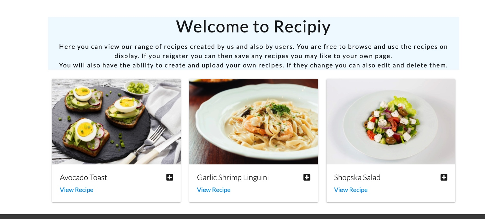

* I want to have a reason of why I would want to register an account.
    * The users are met with a welcome banner under the hero image and above the recipe cards. It states users are welcome to use the site and
    if they wish to they can sign up in order to be able to upload or save recipes to their own page. 

    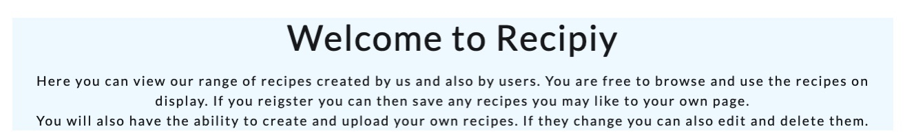

* I want to be able to search for specific recipes if they exist.
    * Users have the ability to search for recipes on the main page of the site. They do not need to have an account and can search by ingredient
    or recipe name. 

     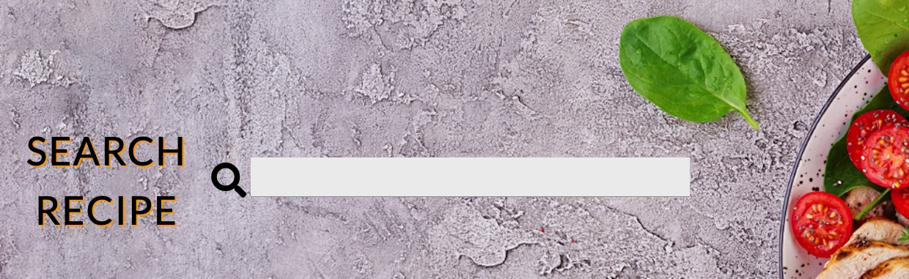

* I want to be able to navigate easily through the site.
    * Users are able to navigate through the site using the navbar at the top which becomes a burger icon when viewed on other devices. The navigation
    is very simple as a user will not have as many tabs if they are not registered. They can register, log in or go to homepage. 

    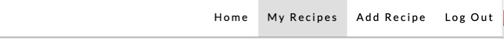 

* I want to be able to view this site on any device.
    * The site is fully responsive and can be viewed on desktop, tablet or mobile. This is tested on all three versions and users will be able to view
    recipes at any time on any device.

    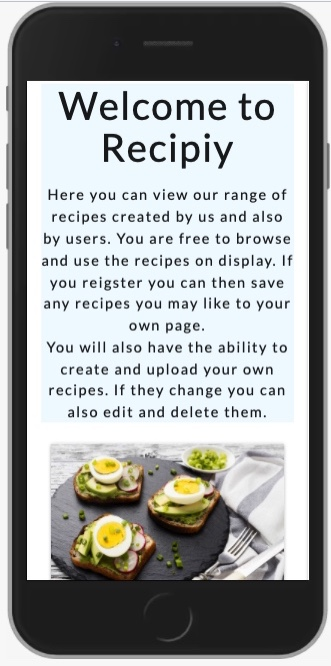 | 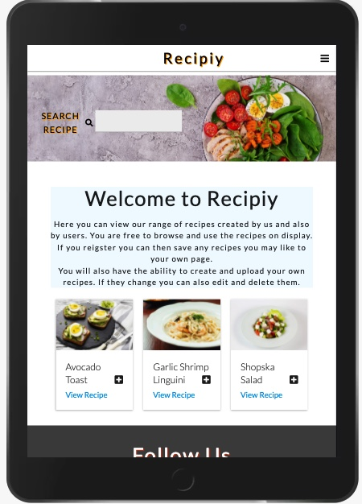 
    

* I want to search for specific ingredients within recipes.
    * Users can search via recipe name or by recipe ingredient if they cannot find exactly what they are looking for. 

    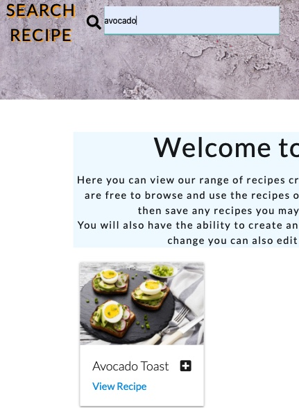 

* I want to be able to view a range of different recipes.
    * There are 4 different cuisine types with recipes from around the world. There will be plenty of range for recipes for users to choose from.
    The best thing is users can use this to upload their own recipes from their culture/background or even a recipe which they have developed and 
    made theirs over time. 

    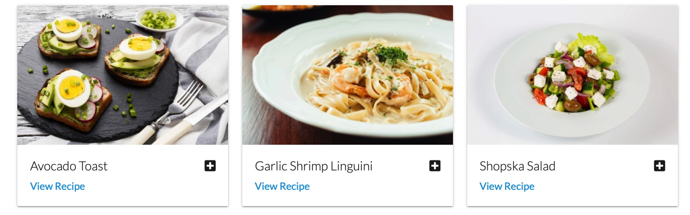 

### As a Returning User:

* I want to be able to securely register and log into my account
    * Users can rest asured they can register with Recipiy and using password hashing the passwords are more secure. The user also is prompted to 
    confirm their password whilst registering to make sure that they have entered the correct password. Once registered Users can securely log in 
    and there are security measures to prevent brite force and access to control of their recipes by external users. 

    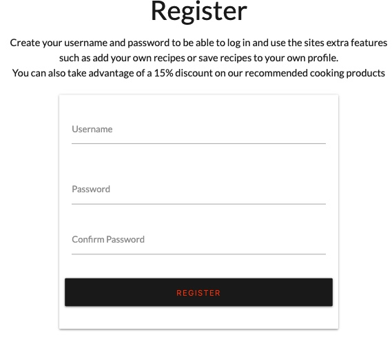 | 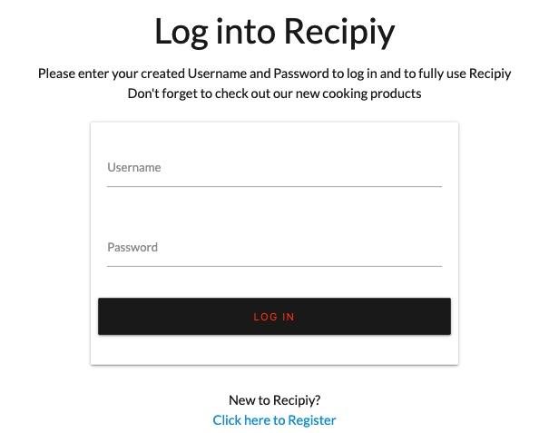 

* I want to be able to upload and share my recipe with others on the site
    * Users have the ability to upload recipes via the add recipe tab which become aavilable once they register. There is a form which needs to be filled
    accurately and the fields are validated so they cannot be left blank. 

    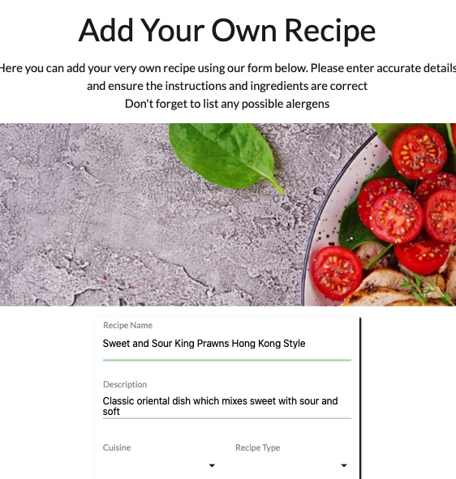


* I want to be able to edit my recipes if they happen to improve over time
    Once a user has uploaded a recipe, all other users can view the recipe and save it to their own page. However only the user who created the recipe can
    edit and make changes to the recipe.

    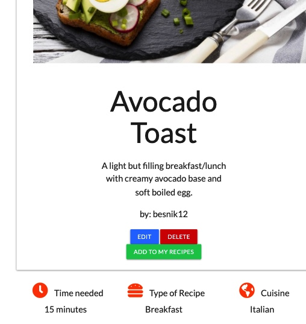 | 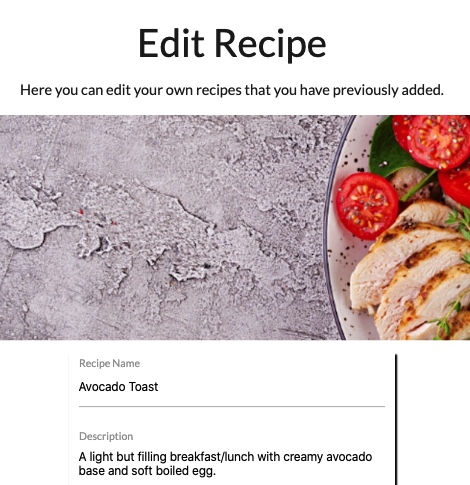

* I want to be able to delete my recipe at any time
    Again once a user has created a recipe if they wish to remove it for any reason they can do so by clicking on view recipe and click on delete. They
    will be notified via a flash message that they have `successfully deleted` their recipe. This option is given to the recipe owner only. 

     | 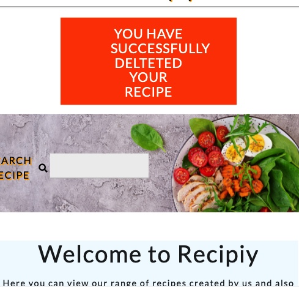

* I want to be able to have a section of where I can save other users recipes including my own.
    * Once a user has registered an account they will be directed to their own page caled My Recipes. Here they can view any recipes they have added.

* I want to be able to see if the recipes include any allergens.
    * Allergies can be very deadly so this is an important feature to include. The users can list allergens whilst uploading their recipies. Other users 
    who view the recipe can see clearly at the top of the recipe if it contains any allergens.

    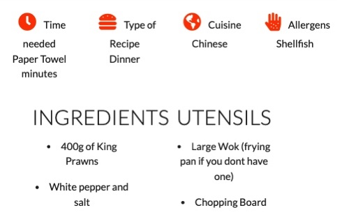

### As a Site Owner:

* I want to be able to add new collections or pages to the site
    * As the site owner I can add additional page and functionality to improve the site for users. Initially the view recipe page did no exist in the
    original wireframes, however it became apparent the information needed cannot be displayed propperly on a card or a modal. This change came to benefit 
    the users with an easy to read recipe and clear text.

* I want the new collection to be added to the appropriate areas whether it is home page or within users displayed pages.
    * Any new collection made on the database can be implemented within the form and display areas of the site. Existing recipes would need to be updated in order to display such information. This can easily be done by the user or the admin.

* I want to be able to edit or delete any pre-existing collections.
    The collection within the database are subject to change and can be taken out from the site and the database. Admin will have access to all recipes and control on the site. 

* I want to be able to edit any promotions or advertising on the site at any time.
    * This feature was placed into features left to implement as this is a future feature to be added to make the site have more of a realworld application.
    Users would have been able to see promotion on cooking utensils. Due to a time management decision this feature would be better used in the next project. 

* I want my users to be informed correctly if any allergens are present in the recipes.
    * The recipe form is required to have the allergens form filled. The information is displayed at the top of the recipe and should be very visible and clear 
    for all users to read. The admin will be able to make a change if this has not been filled in correctly. 

* I want to encourage everyday usage of the site, something which can be used by people frequently.
    * Site owner aim is to have users use this site for everyday use if they are cooking for family or friends or if they are trying to learn how to cook. It is also for people who just want to save their own recipes which they might have on scraps of paper or books. The aim is for the site to be used by a wide range of audience. 

### Features Testing

* **Register an Account with Recipiy**

    * A user can view recipes without creating an account. However they will receive more features if they do so. A user can easily register an 
    account via the nav-link. The passwords are hashed for security and there is a confirmation process for the passsword to make sure there are
    no spelling mistakes. A flash message will appear if they have correctly registered an account.
       
        * This feature has been tested on all devices and this works as expected. The user is directed to their own page when an account is created.
        The user is greeted with a flash message which shows they have successfully registered.

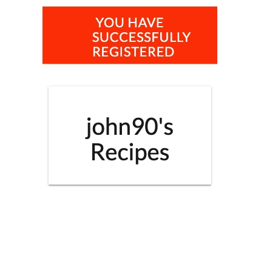


* **Log In and Out of Recipiy**

   * Once a user has created an account they can log in and out of their account easily. They are notified if they have incorrectly entered a 
    password/username. The message does not hint whether the username or password is incorrect for anyone trying to hack another user's details.
        
        * The user is directed to the log in page if they have chosen to log out with a flash message to notify them that they have successfully logged out.
If they log in they will be greeted with their profile page which is that same as shown on the registration testing.

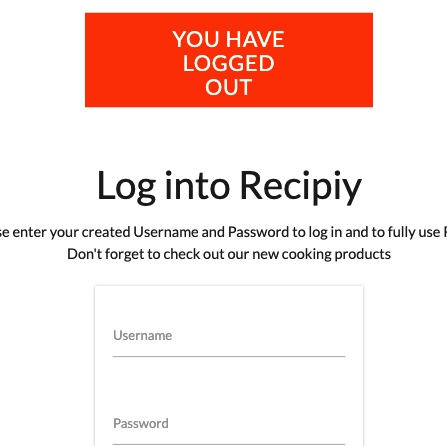

[CRUD] Features Implemented

* **View Recipes**

    * Users can view recipes whether they have an account or not. The recipe cards are displayed on the home page for users to view the image, name
    and description. They then have the option to click on view recipe to view the full information on a separate page.
        
        * This feature works well and is very responsive. Users can clealy see the image and title of the food, if they want they can click on the card to reveal 
recipe description. If the user decides they want to view this full recipe they can click on the link which directs them directly to the view recipe page. 

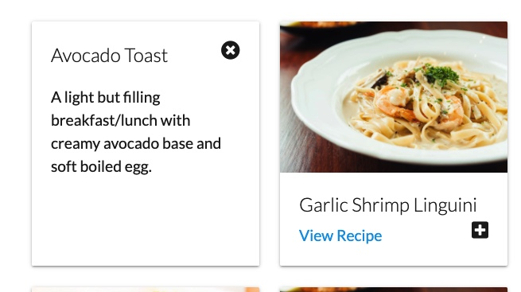 | 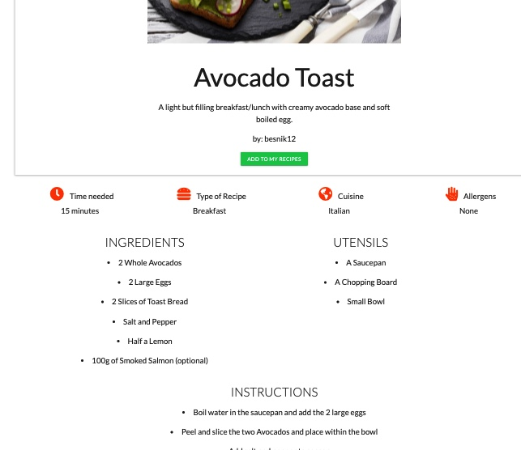

* **Add Recipes**
    
    * Existing users have the option to add their own recipes to the page. This is a feature which would encourage users to register with Recipiy,
    to have the option to upload their own recipes. This can be to store their recipes they may have or simply to share their unqiue recipes with
    others.
        
        * Once a recipe has been added the user will be greeted with a flash message to notify them that they have successfully added a recipe. They will be directed to the view recipe page where they can review their recipe. They will see the controls that the recipe owner sees. 

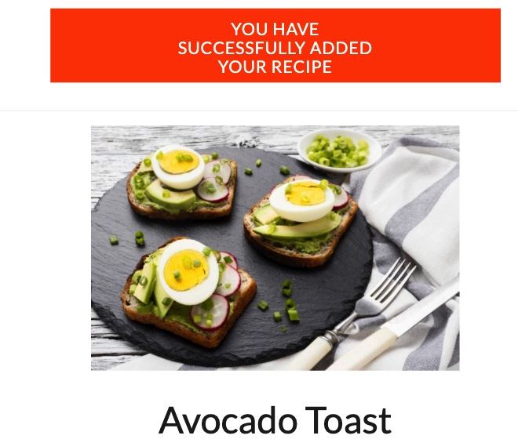

* **Update Recipes**

    * An existing user is able to upate their own recipes which they have uploaded. This is to amend any errors or it can be to improve a recipe.
    Whatever the reason may be this feature is available only to the user who created the recipe, so other users cannot alter any recipe.
        
        * Users can click on the blue 'EDIT' button which will send them to a form. This form will be prefilled with the previous information that the user entered. 
They can change information or add and remove as they please. Once the user has finished editing the recipe they can then click the 'EDIT RECIPE' button at 
the bottom of the form to post the change or 'CANCEL' to cancel the change. They will receive a flash message if the recipe is edited. 

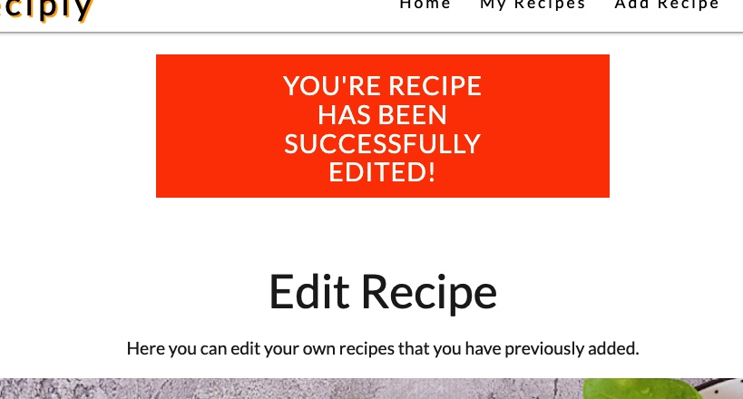 | 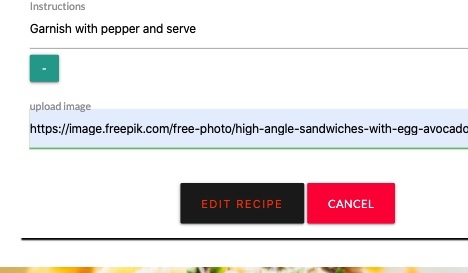

* **Delete Recipes**

    * This feature is only available to the user who created the recipe, there is an option for the user to delete the recipe. They will be prompted via a modal to confirm if they would like to delete the recipe. 
        
        * A user can whilst viewing their recipe on the view recipe page, click on the red 'DELETE' button to delete their recipe. Once this is done then the recipe is deleted and they are notified with a flash message they have successfully deleted their recipe. They are then directed to the home page where the deleted recipe card will not be showing anymore. 


* **Delete Recipes Prompt**

    * This feature is only available to the user who created the recipe, there is an option for the user to delete the recipe. They will be prompted via a modal to confirm if they would like to delete the recipe. 

        * A user may accidentally click on the delete button and therefore there has to be some security measures to prompt the user to confirm their selection. A modal pop up is there to inform the user they have chosen to delete the recipe, they can then confirm the deletion. 

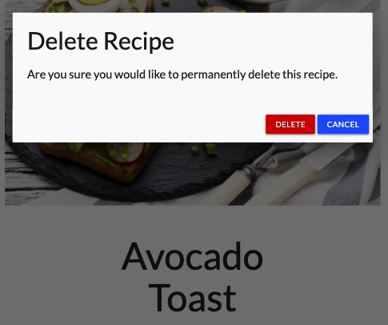

* **Search Recipe**

    * A search bar on the home page which allows users to search recipes based on keywords within the title or description. I have also made
    ingredients a part of the keywords too if users want to search by ingredient. 
        
        * Users can click on the search bar and type a key word of their choice. The search indexes chosen are for recipe ingredients and and recipe name. If a user cannot find what they are looking for via recipe title they can search via ingredient in order to find somthing similar. 

 

* **Add-View-Remove Recipes to Favourites/My Recipes**

    * Users who have logged in will be able to add recipes to their profile page under tab 'My Recipes'. This is to give users the ability to save 
    a specific and not have to search for it in the main page. They have access to it on their own page and can also remove or view the recipe.

        * Users have a button to add the recipe to 'My Recipes' once they are on the view recipe page. They will be greeted with a flash message saying recipe 
        added to 'My Recipes'. A card of the recipe will appear on their page and the user has the ability to view the recipe and/or remove it.  

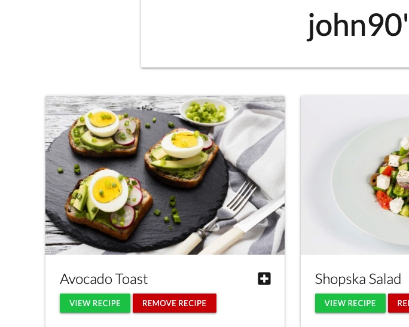 
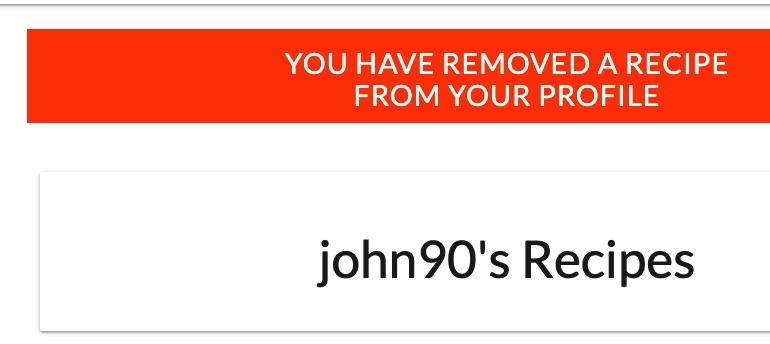 

* **Add image via URL**

    * Users can upload an image of their recipe by pasting in a url or 'image address' directly into the input field. This will render the image for the card and on the view recipe page. 

        * Once a user has filled out their form, before submitting they can upload an image via URL. Once this is done they can press submit on the form and this will then add and image. A message has been placed to notify users to paste in a link to upload an image.

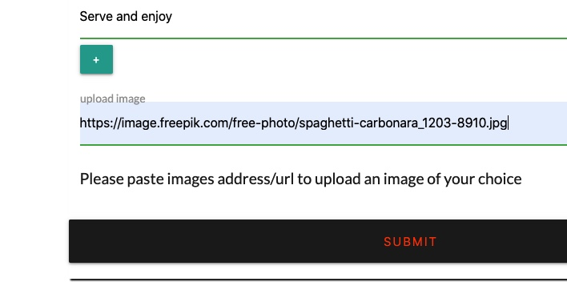 

### Validation Testing

#### HTML

* [W3C HTML Validation](https://validator.w3.org/) - I managed to find one issue on the home page where I had use duplicate id's for the search bar in attempt to override Materialize styling. I had forgotten the id's and this has been corrected. There were many issues with the code but the rest were all to do with Jinja templating syntax which is not compatable with HTML. The majority were missing HTML lang and !DOCTYPE attributes which were all being extended via the base.html using jinja. All of the jinja variables and curly brackets were throwing up errors as these were not recognised as propper code. `, {{ recipes }}`. 

#### JavaScript

* View recipe page known issue - Materialize list styling clashed with < ol > element and would not increment numbers. I left the list's < li > outside as the materialize styling would kick in and turn display off. 

* [JShint](https://jshint.com/) - * There are 13 functions in this file. Function with the largest signature take 1 arguments, while the median is 0. Largest function has 15 statements in it, while the median is 3. The most complex function has a cyclomatic complexity value of 3 while the median is 1. 

* 8 Warnings all displaying `'let' is available in ES6 (use 'esversion: 6') or Mozilla JS extensions (use moz)`.

#### Python

* [PEP8 Online](http://pep8online.com/) - All python files are PEP8 compliant

## Deployment

### Local Deployment

Note - To run this project locally on your own system you must have the following installed in order to do so:

* [Python 3](https://www.python.org/) - Core code to run the application.

* [Pip](https://pip.pypa.io/en/stable/) - Install app requirements.

* [VS Code](https://code.visualstudio.com/) - An IDE of your choice.

* [GIT](https://www.atlassian.com/git/tutorials/install-git) - For cloning and version control.

* [MongoDB](https://www.mongodb.com/) - You will need your own database on MongoDB Atlas. 


You will then need to clone the repository via the following steps:

* Clone the repository via GitHub by clicking on the green button on the right hand side. You also have the option to
click on the drop down button named 'Code' and select download zip file (remembering to unzip it first). You can also
copy the link from the drop down and entering it into the Git CLI terminal:

    * git clone `https://github.com/BesnikShala/Recipiy-MS3-Project.git`.

* Once this has been done the files will unpack and you should then create a `.env` file which will house your sensitive
data such as the MONGO_URI and SECRET_KEY. (If you use [Gitpod full template](https://github.com/Code-Institute-Org/gitpod-full-template) 
most of these will already be ready to use)

* You will then need to install all requirements from the requirements.txt file using the following command: 
    * `pip3 -r requirements.txt`.

* If you do not have a MongoDB account you can sign up for free. Once you have done this you will need to create a new 
Database. The following collections will need to be created in order for the app to function. 

#### USERS
```
_id: <ObjectId>
username: <string>
password: <string>
```

#### RECIPES
```
_id: <ObjectId>
cuisine_type: <string>
recipe_name: <string>
recipe_description: <string>
recipe_time: <int32
recipe_tools: <array>
recipe_instructions: <array>
recipe_ingredients: <array>
recipe_type: <array>
created_by: <string>
allergens: <array>
image_url: <string>
```

#### CATEGORIES
```
_id: <ObjectId>
recipe_type: <string>
```

#### CUISINE
```
_id: <ObjectId>
cuisine_type: <string>
```

#### FAVOURITES
```
_id: <ObjectId>
recipe_id: <string>
recipe_name: <string>
recipe_description: <array>
username: <string>
image_url: <string>
```

* Once these have been added you can then run the program via python3 `app.py` if you are using gitpod IDE. This should open
a port 5000 which you can then open the browser to view content. 

### Remote Deployment

In order to implement this project on Heroku I used the following steps. 

1. requirements.txt and procfile will need to be installed in order to have the required dependencies. A Procfile will also need to be 
created to tell Heroku which type of application is being deployed and how to process it. the following commands are:
    * `pip3 freeze --local > requirements.txt`
    * `echo web: python run.py > Procfile`

2. [Heroku](https://dashboard.heroku.com) is free to sign up and use. You can easily create an account and then create your project app. 
The third tab is labelled 'deploy' where you can connect your GitHub repoistory directly to Heroku. You can then click 'Enable Automatic Deploys'
once you make a commit on to GitHub this will then automatically make the changes to your Heroku App.

3. The next step is to click on 'settings' tab and half way down you will see 'Reveal Config Vars', you can then configure the environmental 
variables as shown:

    * IP: `0.0.0.0`
    * PORT: `5000`
    * MONGO_DBNAME: `<Your project name which you entered when creating the app>`
    * MONGO_URI: `<Your unique and private link to MongoDB> - You will need to alter the username/password on the link as the fields are not filled.`
    * SECRET_KEY: `<You can make your own random secret key or use an online generator>`

4. Once you save the changes you can click hide config vars and your app should be successfully deployed to Heroku.


## Credits

### Content

* Much of the starting code has been used from the Task Manager Walkthrough Project. This was to start the application, I have tried to make sure all the code has been altered to show my understanding and not just simply copied. 

* [Materialize](https://materializecss.com/) - Used for html code and javascript functionality such as cards modal and form.

### Media

* [freepik](https://www.freepik.com/) - The two main images used in the main page and the add/edit recipe pages.
* [unsplash](https://unsplash.com/) - The food images
* [Fontawesome](https://fontawesome.com/v5.15/icons?d=gallery&p=1) - For the icons used throughout


### Code 

* [W3schools](https://github.com/TravelTimN/ci-milestone04-dcd#validators) - For python short cuts and reminders. particularly using the {$and}. 
* Tim Nelson - Using his code which he himself created to fix and issue with Materialize code which doesnt allow validation on select fields. 
* Slack - in particular Amy O'Shea for her MS3 planning video and her time to answer my queries before starting the project. 

### Acknowledgements

* Tim Nelson - My Mentor who not only presented the python lessons and walkthrough videos perfectly but was also there to help guide me in our sessions. 


